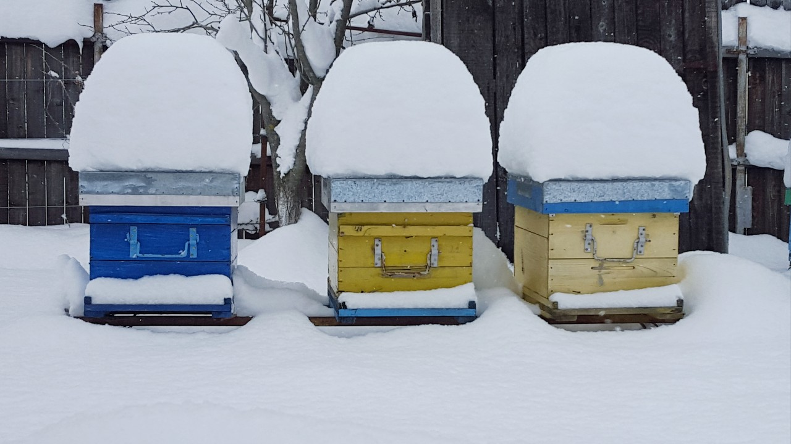

Primăvara în stupină, inspectând sănătatea coloniilor

Fagure de albine cu matcă. Matca este marcată cu o bulină albă, pentru a ajuta identificarea ei

Sculele stuparului: afumătorul, peria, dalta de ridicat rame și furculița pentru îndepărtat căpăcelele de ceară de pe faguri

Iarna, albinele se strâng în ghem în jurul mătcii și bat încet din aripi pentru a se încălzi

Albinele au nevoie de liniște iarna. Ele consumă din mierea pe care au adunat-o cu trudă în timpul verii și pe care un apicultor grijuliu a păstrat-o pentru ele

[Înapoi la pagina principală]({{ site.url }}{{ site.baseurl }})
