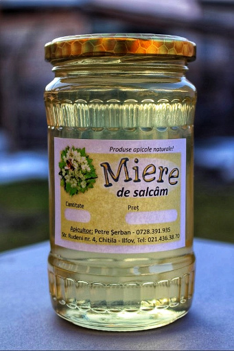

---
#
# Here you can change the text shown in the Home page before the Latest Posts section.
#
# Edit cayman-blog's home layout in _layouts instead if you wanna make some changes
# See: https://jekyllrb.com/docs/themes/#overriding-theme-defaults
#
layout: home
---

Stupina Șerban produce și comercializează produse apicole naturale de cea mai bună calitate. 

La noi găsiți miere de albine din flori de salcâm, tei, rapiță sau polifloră (din mai multe flori).

În limita stocului, vă oferim și polen proaspăt, ceară, propolis și faguri cu miere. 

Pentru că vindem doar atât cât strâng albinele noastre, uneori avem mai puține produse. Alteori avem varietăți neobișnuite de miere, ca mierea de mană sau de fâneață. 

Pasiunea noastră este să vă punem la dispoziție doar produse naturale, fără nimic adăugat, nefiltrate, ne-tratate. 

    
  
Miere de salcâm

    
  
Miere polifloră

    
  
Miere de rapiță

    
  
Polen proaspăt

